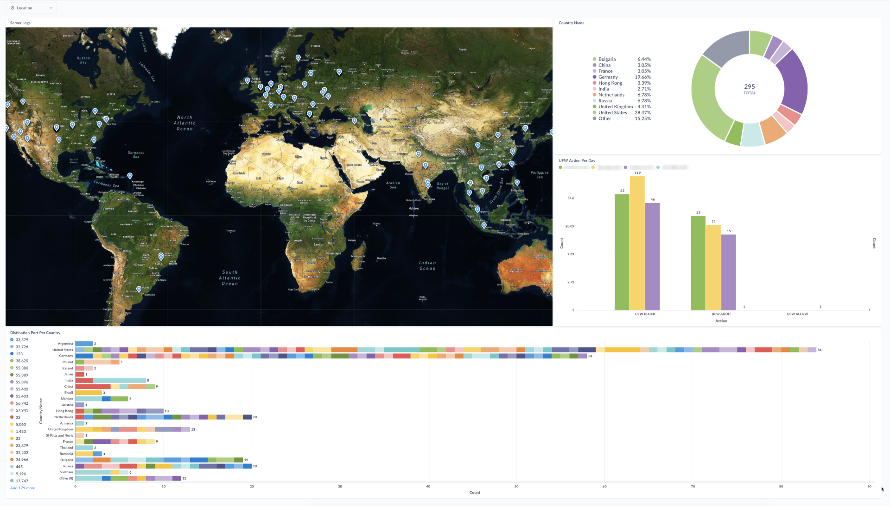

# UFW Log Monitor



> Note: I am using [Metabase](https://github.com/metabase/metabase) to visualize the data. You can use any tool you like.

## Overview

This project provides a script that converts UFW logs to JSON and updates a PostgresSQL database with the new logs. It includes a Dockerfile and a Docker Compose file for containerization, a build script, and a shell script for pretty printing.

## Requirements

### Local Execution

- Python 3.11+ (tested on 3.11)
- PostgresSQL 15.0+ (tested on 15.0)
- Maxmind GeoLite2 City Database - [Install](https://dev.maxmind.com/geoip/updating-databases)
- Python Libraries: 
  - maxminddb
  - psycopg2-binary
  - python-dotenv
- jq (for pretty printing)

#### Installation Ubuntu 22.04 or Debian 11/12

```bash
sudo apt install postgresql jq python3 python3-pip python3-venv
```

##### Create a virtual environment

```bash
python3 -m venv .venv
source .venv/bin/activate
```

##### Install Python Libraries

```bash
pip install maxminddb psycopg2-binary python-dotenv
```

##### Install using poetry

```bash
poetry install
```

##### Rename .env.example to .env and update the values

```bash
cp .env.example .env
```

#### Database Setup

##### Create the database

```bash
CREATE DATABASE your_database;
```

##### Create the User and Assign Permissions
    
```bash
CREATE USER your_user WITH ENCRYPTED PASSWORD 'your_password';
GRANT ALL PRIVILEGES ON DATABASE your_database TO your_user;
```

##### Create the Tables

```sql
CREATE TYPE ufw_action AS ENUM (
  'UFW BLOCK',
  'UFW AUDIT',
  'UFW ALLOW'
);

CREATE TABLE ufw_logs (
  id SERIAL PRIMARY KEY,
  timestamp timestamp(6),
  ip_src inet,
  ip_dst inet,
  proto varchar(10),
  spt int4,
  dpt int4,
  city_name varchar(100),
  country_name varchar(100),
  latitude numeric,
  longitude numeric,
  postal_code varchar(20),
  subdivision_name varchar(100),
  action ufw_action
);
```
#### Environment Variables

| Variable        | Description                                       |
|-----------------|---------------------------------------------------|
| DB_HOST         | The hostname or IP address of the database server |
| DB_NAME         | The name of the database                          |
| DB_USER         | The username used to connect to the database      |
| DB_PASSWORD     | The password used to connect to the database      |
| DEBUG_MODE      | Set to True to enable debug mode                  |
| USE_DATABASE    | Set to True to enable database logging            |
| LOG_FILE_PATH   | The path to the UFW log file                      |
| GEOIP_DB_PATH   | The path to the Maxmind GeoLite2 City Database    |
| OUTPUT_LOG_FILE | The path to the output log file                   |


### Docker Execution

- Docker 20.10.8+ (tested on 20.10.8) - [Install Docker](https://docs.docker.com/engine/install/ubuntu/)
- jq (for pretty printing) - [Install jq](https://stedolan.github.io/jq/download/)
- Maxmind GeoLite2 City Database - [Download](https://dev.maxmind.com/geoip/geoip2/geolite2/)

#### Build the Docker Image

```bash
./build.sh
```

#### Rename .env.example to .env and update the values

```bash
cp .env.example .env
```

#### Run the Docker Container

```bash
docker-compose up -d
```

#### Pretty Print the JSON

```bash
docker exec -it ufw_log_monitor ./pretty_print_json.sh
```

#### Stop the Docker Container

```bash
docker-compose down
```

#### Logs

```bash
docker compose logs -f
```

### Local Execution

#### Run the script

If you are using poetry:

##### Source the virtual environment

```bash
peotry shell
```

```bash
poetry run python3 convert_ufw_to_json.py
```

If you are not using poetry:

##### Source the virtual environment

```bash
source .venv/bin/activate
```

```bash
python3 convert_ufw_to_json.py
```

#### Pretty Print the JSON

```bash
./pretty_print_json.sh
```

## License
Apache 2.0 License. See the [LICENSE](LICENSE) file for details.


